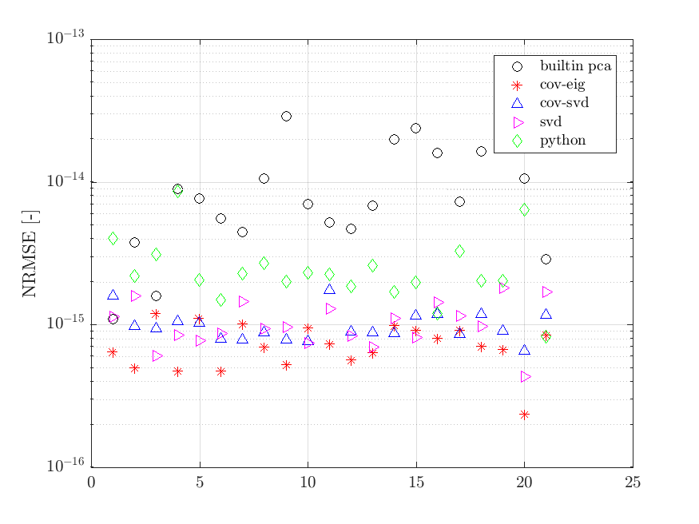
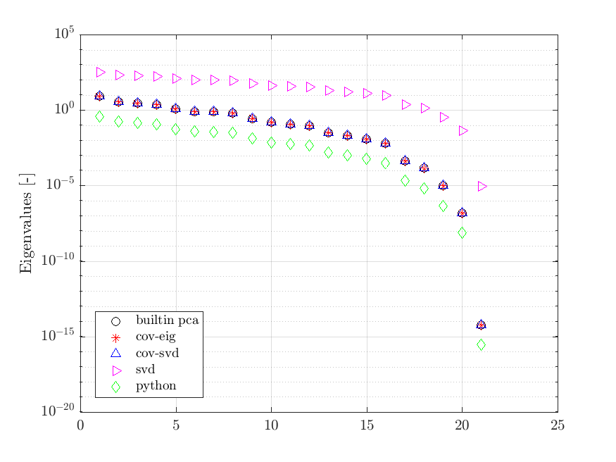

# Unsolved mysteries

## Discrepancy between three ways of computing PCA in Matlab

For a centered and scaled data set `X_cs`:

```matlab
%% Use builtin PCA:
[A_builtin, Z_builtin, eig_builtin] = pca(X_cs, 'Centered', false, 'Economy', false);
X_tilde_builtin = Z_builtin * A_builtin';

%% Use cov-eig PCA:
C = cov(X_cs);
[A_cov_eig, eig_cov_eig] = eig(C);
eig_cov_eig = sort(diag(eig_cov_eig), 'descend');
Z_cov_eig = X_cs * A_cov_eig;
X_tilde_cov_eig = Z_cov_eig * A_cov_eig';

%% Use cov-svd PCA:
C = cov(X_cs);
[U, S, ~] = svd(C);
A_cov_svd = U;
eig_cov_svd = diag(S);
Z_cov_svd = X_cs * A_cov_svd;
X_tilde_cov_svd = Z_cov_svd * A_cov_svd';
```

For comparison, PCA done with Python is also added:

```Python
import numpy as np
from sklearn.decomposition import PCA
import pandas as pd

# Data set:
X_cs = pd.read_csv('X_cs.csv', sep = ',', header=None).to_numpy()

# Perform PCA
pca = PCA()
pca.fit(X_cs)
scores = pca.transform(X_cs)
PCs = pca.components_
eigvals = pca.explained_variance_ratio_

Dataset_approx = np.dot(scores, PCs)

np.savetxt('X_app_X_cs.csv', (Dataset_approx), delimiter=',', fmt='%1.32f')
np.savetxt('eigvals_python.csv', (eigvals), delimiter=',', fmt='%1.32f')
```

The normalized Root Mean Squared error for the reconstruction of the original data set is different:




